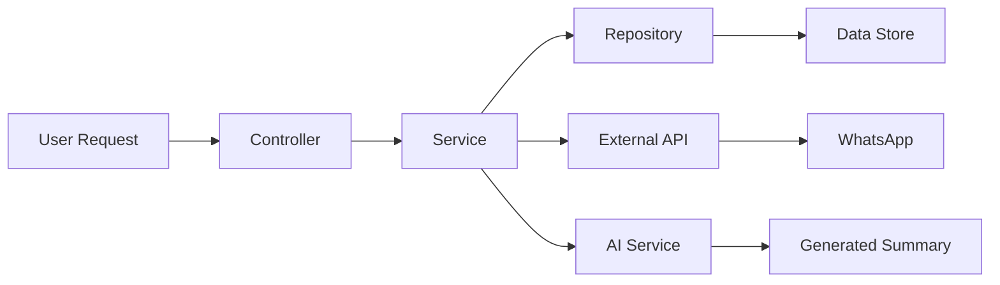

# 🏗️ System Architecture

## Overview

The WhatsApp Group Manager follows **Clean Architecture** principles, ensuring separation of concerns, testability, and maintainability.

## Architecture Layers

```
┌─────────────────────────────────────────────────┐
│                Presentation Layer                │
│  ┌─────────────────┐    ┌─────────────────────┐  │
│  │   Streamlit UI  │    │      CLI Tools      │  │
│  │   (Web Interface)│    │   (Command Line)    │  │
│  └─────────────────┘    └─────────────────────┘  │
└─────────────────────┬───────────────────────────┘
                      │
┌─────────────────────┴───────────────────────────┐
│                 Core Layer                      │
│  ┌─────────────────┐    ┌─────────────────────┐  │
│  │   Controllers   │    │     Services        │  │
│  │   (Orchestrate) │    │  (Business Logic)   │  │
│  └─────────────────┘    └─────────────────────┘  │
│  ┌─────────────────┐    ┌─────────────────────┐  │
│  │     Models      │    │   Repositories      │  │
│  │  (Data Objects) │    │  (Data Contracts)   │  │
│  └─────────────────┘    └─────────────────────┘  │
└─────────────────────┬───────────────────────────┘
                      │
┌─────────────────────┴───────────────────────────┐
│              Infrastructure Layer               │
│  ┌─────────────────┐    ┌─────────────────────┐  │
│  │   WhatsApp API  │    │    Scheduling       │  │
│  │   Integration   │    │     System          │  │
│  └─────────────────┘    └─────────────────────┘  │
│  ┌─────────────────┐    ┌─────────────────────┐  │
│  │   Data Storage  │    │    Messaging        │  │
│  │   (CSV/JSON)    │    │     Service         │  │
│  └─────────────────┘    └─────────────────────┘  │
└─────────────────────────────────────────────────┘
```

## Core Components

### 📋 Models
- **Group**: Represents a WhatsApp group with configuration
- **Message**: Represents a WhatsApp message with metadata

### 🎛️ Controllers
- **GroupController**: Handles group-related operations
- Coordinates between services and external requests

### ⚙️ Services
- **GroupService**: Business logic for group management
- **MessageService**: Message processing and formatting
- **SummaryService**: AI-powered summary generation
- **SummaryCrewService**: CrewAI integration for intelligent summaries

### 🗄️ Repositories
- **GroupRepository**: Data persistence abstraction
- Handles CSV/JSON storage operations

## Infrastructure Components

### 🔌 External Integrations
- **EvolutionClientWrapper**: WhatsApp API client
- **MessageSender**: Message delivery service
- **TaskSchedulingService**: Cross-platform task scheduling

### 🛠️ Shared Utilities
- **DateUtils**: Date/time manipulation
- **GroupUtilsService**: Group-related helper functions

## Data Flow



## Design Principles

### 1. **Dependency Inversion**
- High-level modules don't depend on low-level modules
- Both depend on abstractions (interfaces)

### 2. **Single Responsibility**
- Each class has one reason to change
- Clear separation of concerns

### 3. **Open/Closed Principle**
- Open for extension, closed for modification
- Easy to add new features without changing existing code

### 4. **Interface Segregation**
- Clients shouldn't depend on interfaces they don't use
- Small, focused interfaces

### 5. **Liskov Substitution**
- Objects should be replaceable with instances of their subtypes
- Proper inheritance and abstraction

## Technology Stack

### Core
- **Python 3.8+**: Main programming language
- **Streamlit**: Web interface framework
- **CrewAI**: AI agent framework for summaries

### External Services
- **Evolution API**: WhatsApp integration
- **OpenAI**: AI language model for summaries

### Data Storage
- **CSV**: Group configurations
- **JSON**: Cache and temporary data
- **Text Files**: Logs and exports

### Infrastructure
- **Docker**: Containerization
- **cron**: Task scheduling (Linux/macOS)
- **Task Scheduler**: Task scheduling (Windows)

## Scalability Considerations

### Current Design
- Single instance deployment
- File-based storage
- Direct API integration

### Future Scalability
- Database integration ready
- Microservices architecture possible
- Horizontal scaling capability

## Security Architecture

### API Security
- Token-based authentication
- Environment variable configuration
- Secure API key handling

### Data Protection
- Local data storage
- No sensitive data in logs
- Configurable privacy settings

## Testing Architecture

### Test Layers
```
Tests/
├── unit/           # Unit tests for each component
├── integration/    # Service integration tests
└── e2e/           # End-to-end workflow tests
```

### Test Strategy
- **Unit Tests**: Individual component testing
- **Integration Tests**: Service interaction testing
- **E2E Tests**: Complete workflow validation

## Monitoring & Observability

### Logging
- Structured logging at multiple levels
- Centralized log collection
- Error tracking and reporting

### Metrics
- API response times
- Message processing rates
- Error rates and types

### Health Checks
- API connectivity monitoring
- Service health validation
- Automated diagnostics

## Future Architecture Evolution

### Phase 1: Current ✅
- Clean architecture implementation
- Basic AI integration
- File-based storage

### Phase 2: Enhanced
- Database integration
- Advanced AI features
- Real-time processing

### Phase 3: Enterprise
- Microservices architecture
- Multi-tenant support
- Advanced analytics

---

*This architecture supports the project's current needs while providing a foundation for future growth and complexity.*
